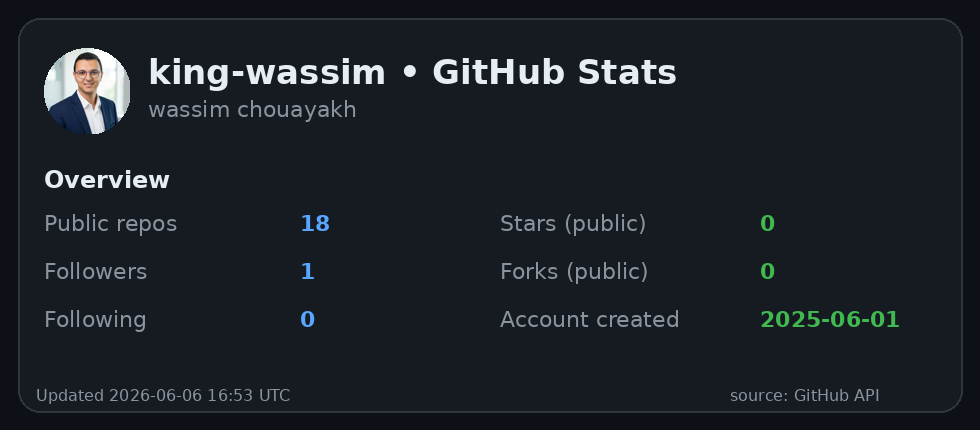
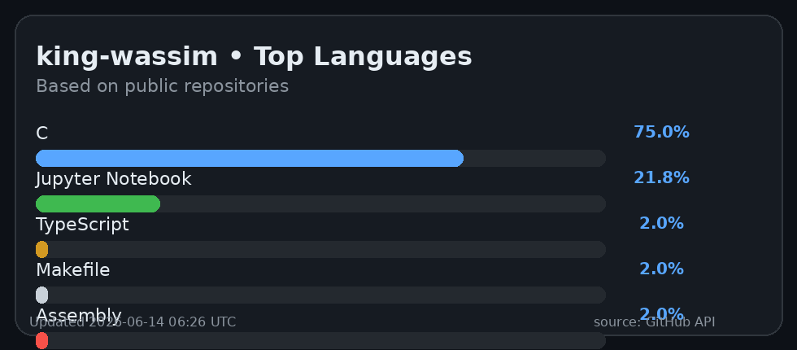
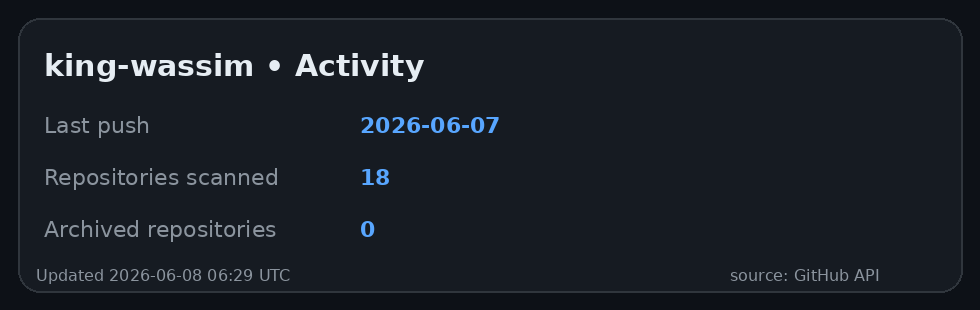

# Hi there, I'm Wassim! 👋

## 💫 About Me:
👨‍🎓 **Engineering Student** in Industrial IT and Automation @ INSAT
💻 **Software & Embedded Systems Developer**
🚀 Passionate about bridging the gap between hardware (STM32, IoT) and modern software (AI, Fullstack web & mobile).
🌱 Currently exploring advanced machine learning and real-time operating systems (RTOS).

## 🌐 Connect with me:
 
 <!-- Assurez-vous que c'est le bon lien -->

---

## 🚀 Featured Projects
* **[SightLine](https://github.com/king-wassim/sightline)** - AI-powered visual risk analysis platform for workplace safety (React, Node.js, Google Gemini).
* **[Antenna Array Simulation](https://github.com/king-wassim/antenna_configuration)** - Full-stack simulation for circular antenna arrays with ML-based pattern inference (TypeScript, React, Mobile).
* **[FoodWise](https://github.com/king-wassim/foodwise)** - Intelligent food analysis application using AI vision for label OCR and nutritional insights.
* **[KPIT Python File Analyzer](https://github.com/king-wassim/desktop-app-windows)** - Powerful desktop tool integrating a Flutter frontend with a Python backend for code analysis.
* **[Monitoring IoT (STM32 & ESP8266)](https://github.com/king-wassim/iot-sensor-stm32)** - Real-time environmental monitoring using STM32, ESP8266, and ThingSpeak API.

---

## 💻 Tech Stack:

**Languages & Core**  
   

**Web & Mobile Development**  
  

**Embedded Systems**  
 

**Machine Learning & Data**  
  

---

## 📊 GitHub Stats :

  
  

 

  

> These images are generated by a GitHub Actions workflow and stored in this repository, so they don't depend on external image providers.
